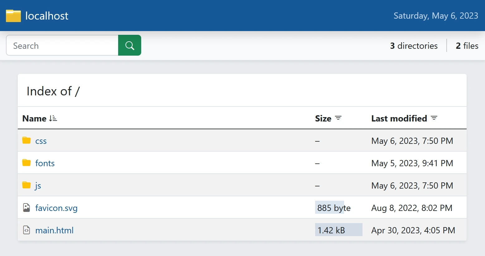

# PHP Index
   

A [PHP](https://www.php.net) directory index generator, implemented in [TypeScript](https://www.typescriptlang.org).

## Documentation
- [User guide](https://docs.belin.io/php-index)

## Development
- [Git repository](https://github.com/cedx/php-index)
- [npm package](https://www.npmjs.com/package/@cedx/php-index)
- [Submit an issue](https://github.com/cedx/php-index/issues)

## Licence
[PHP Index](https://github.com/cedx/php-index) is distributed under the MIT License.
